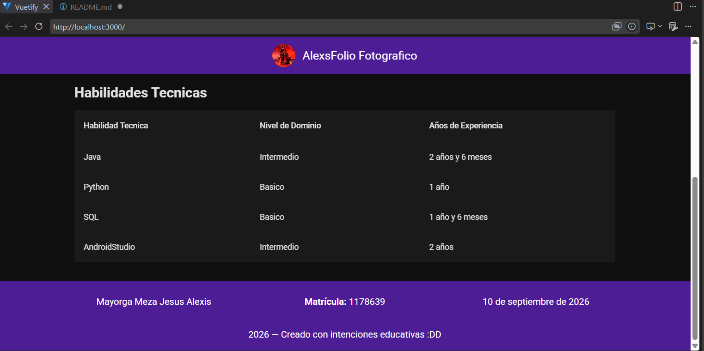
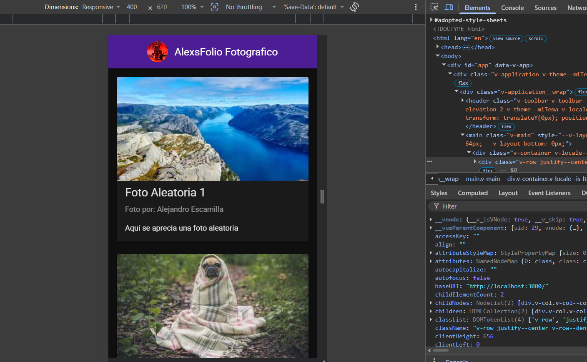
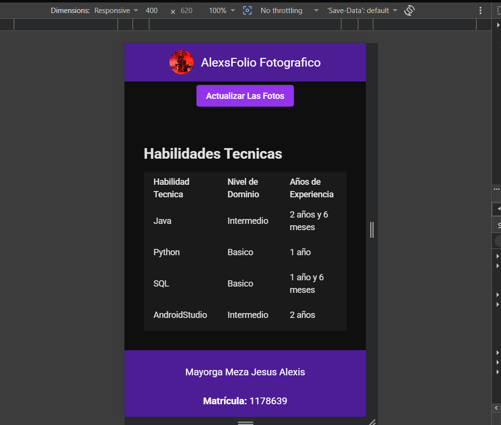

# Galería Dinámica con Picsum API

Aplicacion web de portafolio fotografico desarrollada con Vue 3 y Vuetify 3, que consume la API de Picsum para mostrar imagenes aleatorias con sus respectivos metadatos.

## Captura de pantalla









## Tecnologías utilizadas

- **Vue 3** — Framework de JavaScript (Composition API con `<script setup>`)
- **Vuetify 3** — Biblioteca de componentes UI basada en Material Design
- **Vite** — Herramienta de build y servidor de desarrollo
- **TypeScript** — Tipado estático para el proyecto
- **Picsum Photos API** — Fuente de imágenes aleatorias y sus metadatos
- **Git / GitHub** — Control de versiones

## Instalación y ejecución

1. Clona el repositorio:
```bash
   git clone https://github.com/AlexMeza13/Meta-2.1.git
```

2. Entra a la carpeta del proyecto:
```bash
   cd Meta-2.1
```

3. Instala las dependencias:
```bash
   pnpm install
```

4. Levanta el servidor:
```bash
   pnpm run dev
```

5. Abre `http://localhost:3000` en tu Navegador

## Estructura del proyecto

```
proyecto-vue-vuetify/
├── public/
├── src/
│   ├── assets/
│   │   └── Avatar.png
│   ├── components/
│   │   ├── AppHead.vue
│   │   ├── AppFooter.vue
│   │   ├── Main.vue
│   │   ├── TablaDeDatos.vue
│   │   └── TarjetaImagen.vue
│   ├── plugins/
│   │   └── vuetify.ts
│   ├── App.vue
│   └── main.ts
├── .gitignore
├── index.html
├── package.json
├── vite.config.mts
└── README.md
```

## Funcionalidades

- Consumo de la API de Picsum para obtener imagenes aleatorias con sus autores
- Boton de actualización con estado de carga y manejo de errores de red
- Tema personalizado (morado y negro) usando el sistema de theming de Vuetify
- Diseño responsivo (adaptado a dispositivos moviles y de escritorio)
- Componentes reutilizables

## Autor

- **Nombre:** Mayorga Meza Jesus Alexis
- **Matrícula:** 1178639
- **Asignatura:** Desarrollo de Aplicaciones Web